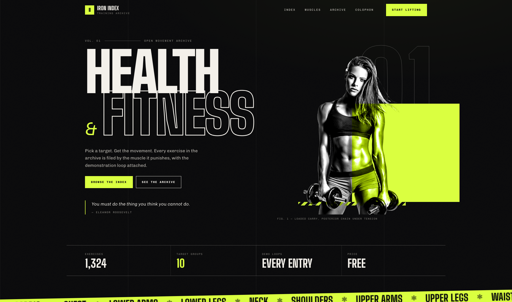

# Iron Index — Health & Fitness Archive



A training archive of 1,324 movements. Pick a target muscle, get the exercises,
each with a still frame and an animated demonstration loop.

## Getting started

```bash
npm install
npm start
```

The app runs at http://localhost:3000. No API key is needed for the archive.

## Data and media

The catalogue ships with the app as `public/exercises.json` and is fetched once
at runtime. Images and animations are pulled from a version-pinned jsDelivr copy
of the upstream dataset, so nothing heavy lives in this repository.

Both come from
[hasaneyldrm/exercises-dataset](https://github.com/hasaneyldrm/exercises-dataset),
via the same approach [openGym](https://github.com/lebe24) uses. The media is not
covered by this project's license — check the upstream terms before
redistributing it.

To host the media yourself, clone the dataset and point the app at your copy:

```
REACT_APP_IMG_BASE=/media/img/
REACT_APP_GIF_BASE=/media/gif/
```

Source media is 180×180, so it upscales on large cards.

The body outlines in the muscle map (`src/lib/body-paths.js`) are derived from
[MuscleMap](https://github.com/melihcolpan/MuscleMap) by Melih Colpan, used under
the MIT License. They are loaded as a separate 40 kB chunk, so only visitors who
reach the map download them.

## Video search

The technique tab calls the YouTube Data API v3 (`youtube/v3/search`) directly.
Set `REACT_APP_YOUTUBE_API_KEY` in `.env.local`; it is the only key the app
needs. Each search costs 100 quota units against a 10,000/day default, so the
free tier allows roughly 100 searches a day. The key is inlined into the browser
bundle, so restrict it by HTTP referrer in the Google Cloud console.

> **Note:** the keys that used to be hard-coded in `src/services/` are in this
> repository's git history and no longer work. Treat them as compromised.

## Muscle map

Section 03 shades a front and back body by how much of the selected group trains
each muscle, and clicking a muscle (on the figure or in the list) narrows the
archive to it. A primary target counts 1 and a supporting muscle 0.4, so
"upper legs" spreads across quads, hamstrings and glutes rather than counting
three times. Shading is relative to the heaviest muscle in the current selection,
so the map reads as a balance rather than an absolute.

The dataset names muscles inconsistently: "delts", "deltoids" and "shoulders" are
one muscle, "lats" and "latissimus dorsi" another. `src/lib/muscles.js` collapses
every spelling onto the eighteen the map can draw, and drops what it cannot draw
(hands, ankles, "cardiovascular system") rather than guessing. That logic is
ported from openGym.

## Deploying

The build needs Node 24. `engines.node` in `package.json` and `.nvmrc` declare
it; on Vercel the dashboard setting under Project Settings takes its own
precedence, so check it there if a build reports an invalid Node version.

Set `REACT_APP_YOUTUBE_API_KEY` in the host's environment variables too, and add
the deployed domain to the key's HTTP referrer restrictions. Without that the
archive and muscle map work but video search returns 403.

`ANTHROPIC_API_KEY` powers the coach and must be set in the Vercel dashboard as
a plain environment variable. Do not give it a `REACT_APP_` prefix; that would
inline it into the browser bundle for anyone to read.

### Web Analytics

Vercel Web Analytics is wired up in `public/index.html` as a plain script tag
rather than the `@vercel/analytics` package. The package declares an optional
SvelteKit peer that wants TypeScript 5, which npm tries to resolve against
react-scripts' TypeScript 4 pin; installing it needs `--legacy-peer-deps`, and
the lockfile that produces makes `npm ci` fail on the build machine. The script
is what the package injects anyway, and with no router there are no route
changes for it to track.

Turn it on under Analytics in the Vercel dashboard. Nothing is counted until you
do.

Only Vercel serves `/_vercel/insights/script.js`, so a hostname guard skips the
request on localhost and on the `pages.dev` and `github.io` mirrors, where it
would 404 on every page view. It fails open: any other host still loads it, so a
custom domain pointed at Vercel needs no change. Add a host to the pattern in
`public/index.html` to opt it out.

## Workout builder

`/build` is its own page and generates a session from the catalogue. Pick a split, a goal, the
kit you have and a length; the generator fills an ordered list of muscle slots,
compounds in the first half so the heavy work lands while you are fresh, then
isolation. Sets, reps and rest come from the goal. Shuffle re-rolls the seed;
the same seed always rebuilds the same session.

Selection is ranked rather than random. The catalogue holds dozens of variants
per muscle and most are obscure, so an even draw produces sessions full of
archer push-ups. Candidates score on mainstream equipment, a recognised
movement pattern in the name, and a canonical kit prefix, and lose points for
very long names, parenthetical variants and two movement words in one name
("dumbbell biceps curl squat"). Stretches and mobility drills are excluded
entirely: programming a hamstring stretch for five sets of three is nonsense.

**Download card** renders the session to a 1080x1350 PNG on a canvas, sized for
an Instagram post. No library: the exercise art is served with
`Access-Control-Allow-Origin`, so loading it with `crossOrigin="anonymous"`
keeps the canvas exportable.

## Coach

`api/chat.js` is a Vercel function that proxies the workout and your question
to Claude. It exists so `ANTHROPIC_API_KEY` stays on the server; a key in a
`REACT_APP_*` variable is published to every visitor.

The endpoint is public, so it is bounded on purpose: short replies, low effort,
a capped transcript, and per-IP rate limiting of 12 messages per 10 minutes.
That limit lives in a warm instance's memory, so the real ceiling is the spend
limit on your Anthropic account. Set one.

It only runs on the deployed site. Under `npm start` there is no function, and
the panel says so rather than looking broken. To exercise it locally, run
`vercel dev` instead.

## Routing

Two pages, `/` and `/build`, served by a hand-written router in
`src/lib/router.js` rather than react-router: that library would have added
roughly a quarter of this bundle to serve two paths with no params. If nested
or parameterised routes ever appear, replace it rather than extending it.

`vercel.json` rewrites any path that is not a file or an API function to
`index.html`. Without that rewrite a direct hit on `/build`, or a refresh while
on it, returns 404. Keep that file to the properties Vercel's schema allows:
it rejects unknown keys, and an invalid `vercel.json` fails the deployment
before the build starts.

Vercel is the only deployment. There is no GitHub Actions pipeline: Pages
cannot run `api/chat.js` and has no rewrite support, so `/build` and the coach
would both break there.

## Design

Brutalist sports-press: asphalt ground, bone type, one acid-lime signal colour,
hairline rules and condensed athletic display type. Big Shoulders Display for
headlines, Chivo for body copy, Chivo Mono for labels and data. Tokens live in
`src/styles/tokens.css`; every colour, rule and timing reads from there.

Exercise cards show the still frame by default and only request the animation
once you hover or press play, which keeps a page of twelve cards light.

## Structure

```
public/exercises.json     the movement catalogue
api/chat.js               Vercel function behind the coach
vercel.json               SPA rewrite so /build survives a refresh
src/
  App.js                  shell: masthead, route switch, footer
  pages/                  Home and Build
  styles/                 design tokens + base styles
  components/             one .jsx + .css pair per component
  lib/                    muscle resolution, body geometry, workout generation
  services/               catalogue loader, YouTube search, quotes
```

`pages/Home.jsx` owns the archive state. `WorkoutBuilder` owns its own.

## Stack

React 18 · Create React App · plain CSS with custom properties. No UI framework.

---

Built by [lebe24](https://github.com/lebe24) · [lebe.pages.dev](https://lebe.pages.dev/)
